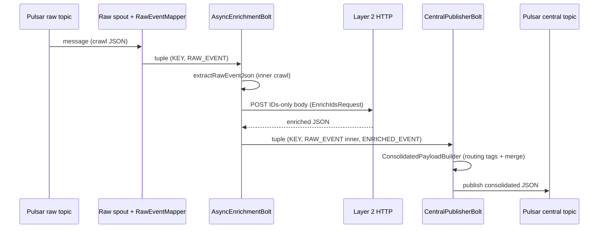
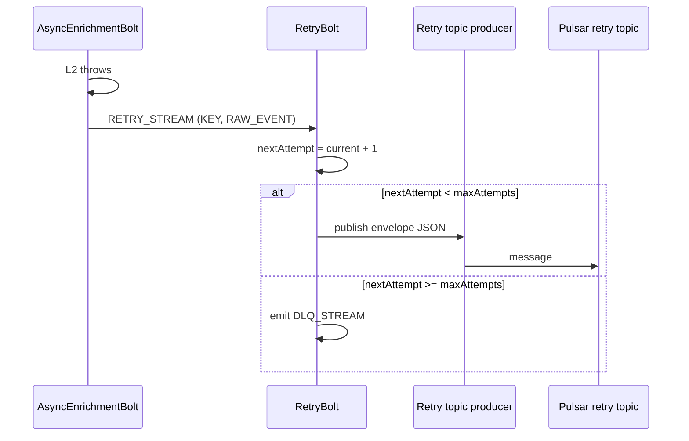
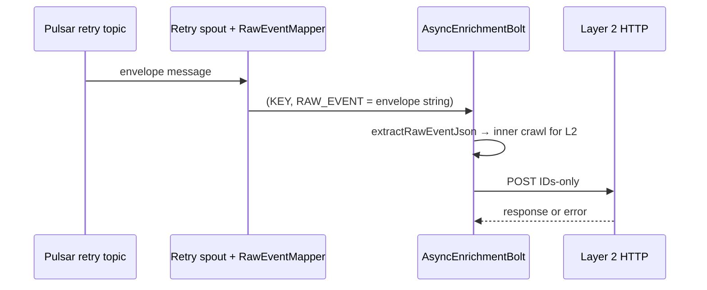
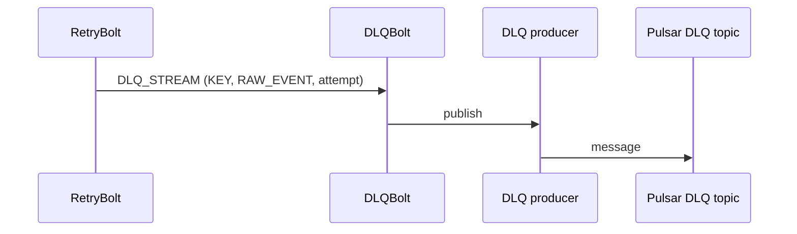

# Layer 1 — Sequence flows

## Happy path (raw spout → central topic)

## L2 failure → retry topic

## Retry spout re-enters enrich

## DLQ path

## Attempt counting (conceptual)

1. First L2 failure: tuple is **plain** crawl JSON → `currentAttempt = 0` → `nextAttempt = 1` → publish **envelope** with `attempt: 1` to retry topic.
2. Retry consumer delivers envelope → enrich unwraps inner JSON for L2.
3. On repeated L2 failure, `nextAttempt` increases until it reaches `maxAttempts` → **DLQ** (no further retry publish).

See `RetryUtil` and `RetryBolt` for the exact rules.
